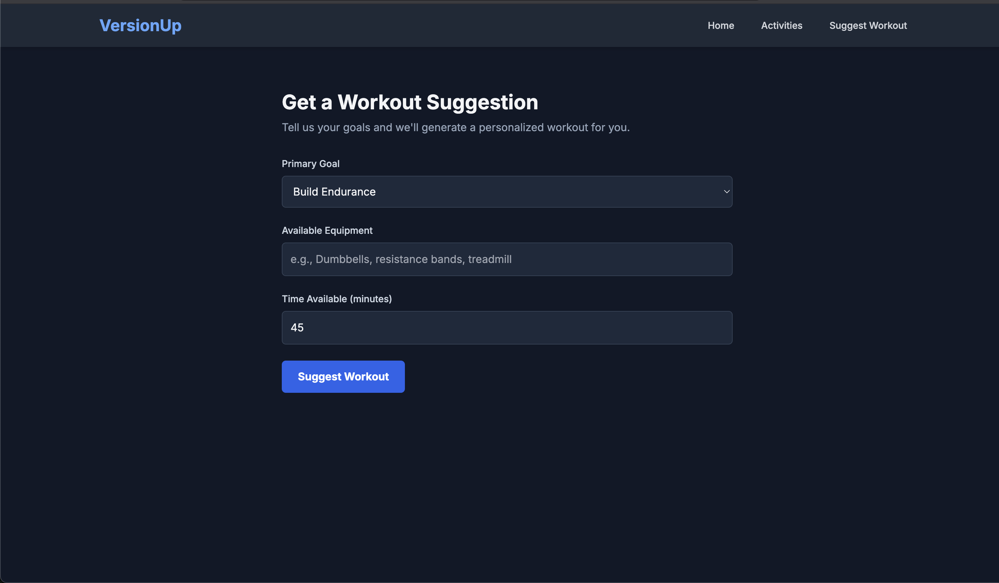

# VersionUp - AI Workout Coach

🚧 Work in Progress 🔧

VersionUp is a web application designed to act as a virtual workout coach. It synchronizes with a user's Strava account to analyze their activity data. Leveraging AI, it provides personalized feedback and recommendations for future workouts based on the user's goals.

This project is mobile-first, ensuring a seamless experience on any device.

## Project Purpose

The primary goal of this project is to serve as a practical learning experience for integrating Artificial Intelligence into a real-world, full-stack application. It explores the end-to-end process from data acquisition (via the Strava API) and data processing to generating intelligent, actionable insights for the user.

## Screenshots

## Tech Stack

The project is built with a modern, full-stack architecture:

### Frontend

*   **Framework**: [Next.js](https://nextjs.org/) (v14+)
*   **Language**: [TypeScript](https://www.typescriptlang.org/)
*   **Styling**: [TailwindCSS](https://tailwindcss.com/)

### Backend

*   **Framework**: [FastAPI](https://fastapi.tiangolo.com/)
*   **Language**: [Python](https://www.python.org/) (3.11+)

### External Services

*   **Data Source**: [Strava API](https://developers.strava.com/)
*   **AI Model**: [Llama-3.1-8B-InstructI](https://huggingface.co/meta-llama/Llama-3.1-8B-Instruct)
*   **Model provider**: [HuggingFace](https://huggingface.co/)
*   **Authentication & DB**: [Firebase](https://firebase.google.com/) (Auth and Firestore)

## Getting Started

To get the project running locally, follow these steps.

### Prerequisites

*   Node.js (v18+)
*   Python (v3.11+)
*   A Strava account

### Backend Setup

1.  Navigate to the `backend` directory.
2.  Create and activate a virtual environment: `python3 -m venv venv && source venv/bin/activate`
3.  Install dependencies: `pip install -r requirements.txt`
4.  Create a `.env` file and add your Strava and AI provider credentials.
5.  Download your `firebase-service-account.json` from the Firebase Console and place it in this directory.
5.  Run the server: `uvicorn main:app --reload`

### Frontend Setup

1.  Navigate to the `frontend` directory.
2.  Install dependencies: `npm install`
3.  Create a `.env.local` file and add your Firebase web app configuration keys (prefixed with `NEXT_PUBLIC_`).
3.  Run the development server: `npm run dev`
